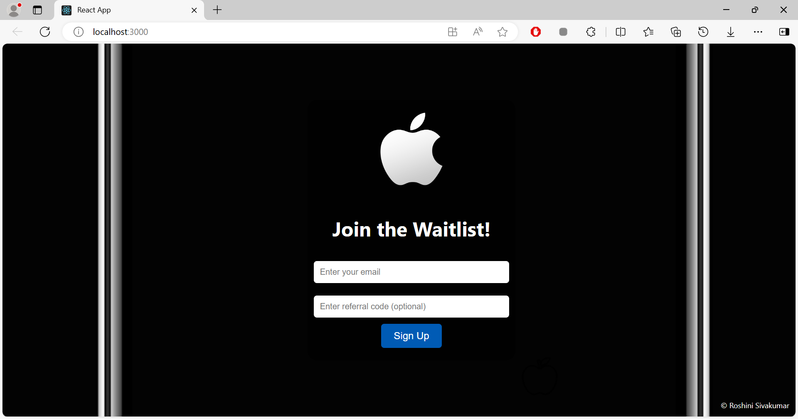

# Waitlist Application
This is a full-stack waitlist application that allows users to sign up with their email, receive a referral code, and move up the waitlist by referring others. When a user reaches the top of the waitlist, they receive an email with a coupon code.

## Features

- User sign-up with email and optional referral code
- Dynamic waitlist position tracking
- Email notifications for top waitlist position
- Responsive design for both desktop and mobile

## Technologies Used

- Backend: Node.js, Express.js, MongoDB, Mongoose
- Frontend: React.js
- Email: Nodemailer
- Deployment: Heroku (or your preferred service)

## Screenshot



## Setup

### Prerequisites

- Node.js
- MongoDB

### Installation

1. **Clone the repository:**

   ```
   git clone https://github.com/yourusername/Waitlist-app.git
   cd Waitlist-app
   ```
2. **Install dependencies:**

   - **Backend:**
     Navigate to the backend directory (if separated) and install dependencies:
     
     ```
     cd backend
     npm install
     ```
   - **Frontend:**
     Navigate to the frontend directory (if separated) and install dependencies:

     ```
     cd ../frontend
     npm install
     ```
3. **Create a .env file:**

   Copy the .env.example file to a new .env file and add your environment-specific settings:

   ```
   cp .env.example .env
   ```

   Update the .env file with the following variables:
   ```
   MONGO_URI=your_mongodb_uri
   EMAIL_USER=your_email@gmail.com
   EMAIL_PASS=your_email_password
   ```
4. **Start the servers:**

   - **Backend:**
  
     ```
     cd backend
     node server.js
     ```

   - **Frontend:**
     Open another terminal and navigate to the frontend directory:

     ```
     cd ../frontend
     npm start
     ```

## Deployment

For deployment, follow these steps:

1. **Deploy the backend:**

   -Use Heroku or another service of your choice.
   -Set up environment variables on the deployment platform.

2. **Deploy the frontend:**

   -You can deploy the React frontend using Netlify or Vercel.


**Notes:**
This project was created specifically to demonstrate my full-stack development skills as part of a job interview process. It showcases my ability to build and integrate both front-end and back-end technologies and manage a complete application workflow.
     


   

   

     
   
   

